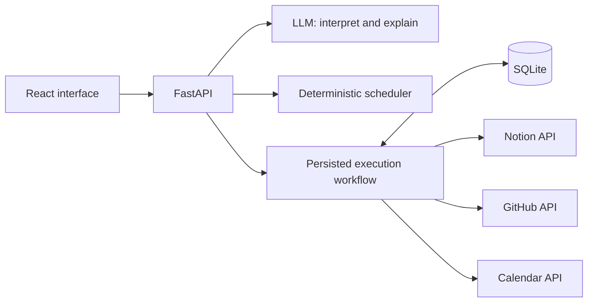
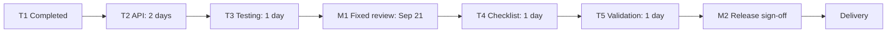

# Deadline Relay — Product Requirements Document

**Project:** Multi-App AI Agent Hackathon
**Status:** Implementation in progress; connected Vercel deployment required
**Version:** 1.0
**Research baseline:** September 10, 2026
**Build assumption:** Two builders, one hackathon build window
**Delivery:** Connected Vercel application, reproducible repository, and real end-to-end acceptance evidence

> Change a deadline once. Understand its consequences, approve a feasible plan, and verify the updates across your project tools.

This PRD consolidates the product, UX, integration, execution, evaluation, and submission specifications. All requirements are mandatory unless explicitly marked **optional**. Targets are proposed acceptance targets, not measured results. The API and event research below was checked during PRD preparation; credentials and live integration behavior have not been validated.

> **September 13 scope correction:** The application must use real model and provider calls and eventually run on Vercel. Mock project records may be created inside the actual apps for acceptance testing. Local simulation is not an accepted product or end-to-end result. Local SQLite/background-task and demo-only assumptions below are historical; the updated architecture is in deadline-relay/docs/PRODUCTION-TARGET.md (docs/PRODUCTION-TARGET.md within the repository).

## 1. Summary

Deadline Relay helps a project owner handle a changed delivery deadline across Notion, GitHub, and Google Calendar. It reads the current records, identifies dependencies and scheduling conflicts, proposes an exact revision, requests approval, applies the approved changes, and verifies the resulting state.

The smallest complete build supports one fictional release with five tasks, one fixed review, one movable release meeting, and one GitHub milestone. An unrelated task and event demonstrate that the agent preserves unrelated work.

The primary demonstration starts with an impossible September 18 deadline. A fixed September 21 review and two subsequent working days make September 24 the earliest feasible delivery date under the supplied model. The app proposes that alternative and waits for fresh approval before changing anything.

## 2. Problem, audience, and value

### 2.1 Audience

A project owner or engineering lead coordinating one small software release through Notion, GitHub, and Google Calendar.

### 2.2 Problem

A deadline change can leave the accepted task plan, engineering milestone, and review meetings inconsistent. Editing all the date fields successfully does not establish that the resulting schedule is feasible. Partial failures make coordination harder because some tools may update while others retain their original state.

### 2.3 Desired outcome

The user can understand the consequences of a deadline change, approve a concrete schedule, and see evidence that the approved edits were applied correctly. If execution is interrupted, the user can identify what changed and resume safely.

### 2.4 Positioning

**Differentiation hypothesis:** evidence-backed coordination across three independent apps, with approval bound to exact edits and recoverable execution.

Do not claim that dependency scheduling, approval previews, or AI rescheduling are individually novel. Notion and Asana already support dependency date shifting, and Motion supports adaptive scheduling and unschedulable-work detection. Research does not establish that competitors lack this entire workflow. See [research notes](#15-research-notes).

## 3. Hackathon constraints

| Constraint | Requirement |
| --- | --- |
| Event | September 13, 2026 |
| Build window | 9:30 AM–4:00 PM Pacific; September 13, 10:00 PM–September 14, 4:30 AM IST |
| Team | Public brief permits one to four; this plan assumes two builders |
| Core requirement | Useful, multi-step AI agent connected to at least three external apps |
| Submission | Working project or repository; two-minute demo; short system/reliability brief |
| Judging | Technical execution 30%; reliability/evaluation 25%; usefulness 20%; originality 15%; demo clarity 10% |
| Stack | Python backend; React interface |
| Environment | Windows and PowerShell; workspace `F:\Projects\MultiAgentHack` |
| Accounts | Dedicated demo resources with realistic fictional data |
| Runtime | Localhost; no mandatory hosting |

The [public event brief](https://multiappagenthackathon.com/) does not state that multiple agents or MCP are required. Advance implementation, account/fixture preparation rules, and replica-only eligibility remain organizer dependencies. The build plan assumes implementation begins at the permitted start. Simulated services do not replace the three required live integrations in this PRD.

## 4. Scope and priorities

### 4.1 Required MVP

- One preconfigured project, one timezone, and one project-owner calendar.
- Five linked release tasks, one milestone, one fixed review, and one movable non-recurring meeting.
- An unrelated task and event used as preservation checks.
- Manual request and refresh triggers.
- Natural-language deadline interpretation with clarification for ambiguity.
- Deterministic finish-to-start scheduling using supplied estimates and constraints.
- Source-linked impact preview and exact before/after approval table.
- Meaningful approved writes across Notion, GitHub, and Calendar.
- Durable operation tracking, read-back verification, and safe partial recovery.
- A reproducible fixture, required evaluation matrix, and recorded demonstration.

### 4.2 Out of scope

- Public login, billing, multiple tenants/projects, or a production SaaS roadmap.
- Monitoring, webhooks, background synchronization, or autonomous deadline changes.
- Resource-level workforce scheduling, inferred availability, or task splitting.
- Invented estimates, owners, dependencies, or capacity assumptions.
- In-progress task replanning, recurring/all-day event moves, or multiple movable meetings.
- Creating issues, milestones, or meetings during normal execution.
- GitHub Projects custom fields, vector databases, general-purpose RAG, coding agents, custom MCP servers, or multi-agent orchestration.
- Universal rollback, distributed transactions, or global schedule optimality.

The two-builder assumption concerns implementation staffing. It is not a capacity model for the fictional release.

### 4.3 Optional features and cut order

Cut in this order when time is limited:

1. Lemma or Arga integration.
2. Model-generated explanatory prose; retain factual deterministic explanations.
3. Diagram animation, visual polish, and extra language examples.
4. Recovery footage in the two-minute demo; retain recovery functionality and tests.
5. Additional fixtures beyond the required evaluation matrix.

Do not cut the third live integration, exact approval binding, narrow-write safeguards, read-back verification, or safe recovery. Without those, the complete MVP is not achieved.

## 5. User journey and UX

### 5.1 End-to-end journey

1. Open the configured project and inspect connection health.
2. Enter a natural-language deadline-change request.
3. Read the current project records from all three apps.
4. Resolve the date and relevant dependencies.
5. Show affected work, unchanged relevant items, unrelated preserved items, conflicts, and source links.
6. Propose a feasible revision or explain why the requested date cannot work.
7. Display exact before/after changes for one plan version.
8. Obtain approval and execute that version.
9. Read affected records back and validate the resulting schedule.
10. Show completed, failed, uncertain, and unattempted operations with the appropriate recovery action.

### 5.2 Interface states

| State | Required content | Primary actions |
| --- | --- | --- |
| Request | Project name, timezone, current deadline, connection health, last check, request field | Refresh; analyze request |
| Impact preview | Resolved date, evidence, dependency diagram, conflicts, alternative date, changed and unchanged items | Clarify; review alternative |
| Approval | Before/after table, operation count, plan version, snapshot time, assumptions | Approve and apply |
| Execution results | Per-operation status, read-back evidence, timestamps, source links, outcome summary | Resume safely; review changed sources |

Use a readable table and a small dependency diagram. Do not build a general project-management dashboard. Display dates in the configured timezone and show complete dates at approval.

### 5.3 Required status language

| Status | Meaning |
| --- | --- |
| Feasible under supplied assumptions | The proposed schedule satisfies the supported model |
| Requested deadline infeasible | A supplied constraint or dependency chain prevents that deadline |
| Cannot evaluate | Required information or access is missing |
| Unsupported | The request exceeds the defined scheduling model |
| Partially applied | Some provider changes succeeded and others remain unfinished |
| Outcome uncertain | A write may have occurred and requires reconciliation |
| Verified | Subsequent provider reads match the intended state and required invariants |

Never report complete success based only on successful API responses. State “earliest feasible date under this model” only when the supported algorithm establishes it.

## 6. Functional requirements and acceptance criteria

These IDs are shared by implementation, tests, and submission evidence.

| ID | Requirement | Acceptance criterion |
| --- | --- | --- |
| R01 | Inspect connections | Show separate authentication/read health per provider. Missing access blocks executable plans. A successful read alone does not prove write readiness. |
| R02 | Fetch bounded, explicitly linked data | Every writable resource resolves through configured IDs. Missing links, inaccessible dependencies, incomplete pagination, or incomplete responses block planning. |
| R03 | Resolve intent safely | Display an absolute date and timezone. Ambiguous or unsupported requests cannot generate executable plans. |
| R04 | Calculate and validate schedules | Preserve durations and immutable work; enforce finish-to-start dependencies and supported calendar constraints. |
| R05 | Explain impact with evidence | Link each change and conflict to its sources. Distinguish unchanged relevant items from unrelated records. |
| R06 | Bind approval to exact edits | Execute only the approved plan ID, version, hash, and operation set. Make zero external writes before approval. |
| R07 | Reject stale plans | Recheck relevant source state before execution. Material drift requires a new preview and approval. |
| R08 | Perform narrow writes | Update only approved fields on allowlisted existing resources. Use supported provider preconditions. |
| R09 | Persist execution evidence | Commit intended values before sending writes; retain attempts, outcomes, and verification evidence. |
| R10 | Recover partial execution | Reconcile uncertain writes before retrying. Duplicate submit/resume does not create another run or unnecessarily repeat verified work. |
| R11 | Verify outcomes | Read-back values and final constraints pass before complete success. No failed, uncertain, or unverified operation remains. |
| R12 | Preserve unrelated work | No writes target unrelated resources; unapproved user-controlled fields on edited resources remain unchanged. |
| R13 | Enforce trust and credential boundaries | Retrieved content cannot expand scope or bypass approval. Secrets remain absent from frontend, logs, source control, and recordings. |
| R14 | Deliver a reproducible submission | Provide a local app, locked dependencies, setup/run/test instructions, recording, and system/reliability brief. |
| R15 | Report measured evaluation | Separate live and simulated results; include denominators, failures, recovery, latency, and model usage. |

## 7. Scheduling specification

### 7.1 Scheduling defaults

| Dimension | Default |
| --- | --- |
| Timezone | IANA `Asia/Kolkata` |
| Working days | Monday–Friday; explicitly empty holiday list |
| Task granularity | Whole working days, 09:00–18:00 |
| Task duration | Positive integer, inclusive count of working dates; weekends do not consume duration |
| Meeting hours | 10:00–17:00 on working days |
| Meeting candidates | Starts on a 30-minute grid; preserve the exact existing duration |
| Date-only delivery deadline | Delivery by 18:00 on the requested local date |
| Dependencies | Zero-lag finish-to-start |
| Horizon | Thirty working dates beginning at the configured planning start |
| Immutable work | Completed tasks, fixed nodes, and unrelated events |
| Calendar scope | One configured owner calendar; at most one movable meeting |

A task starts at 09:00. A task following an 11:00–12:00 review therefore starts on the next working day. A meeting following a task ending at 18:00 also needs a later working day.

Completed historical tasks can precede the horizon and remain fixed. Unfinished work cannot start before the planning start or its supplied `Not before` date.

Estimates are elapsed working days, not measured person-hours. Tasks may overlap when dependencies permit it. The model does not establish staffing capacity, and calendar meetings do not automatically reduce task-day capacity.

For a weekend deadline, preserve the requested date and place required work in preceding available working slots. Do not silently change the request to Monday. Requests outside the horizon require an explicit scope change. Ambiguous phrases such as “next Friday” or `09/10` require clarification.

### 7.2 Deterministic algorithm

1. Resolve the release ancestor graph through explicit predecessor IDs. Reject missing nodes, cycles, invalid durations, and contradictory records.
2. Generate candidate intervals: working-day task ranges, allowed meeting slots, or a single immutable interval.
3. Traverse topologically to find each node's earliest feasible interval after its predecessors. The release is a terminal completion constraint, not a task with an invented duration.
4. If a fixed node cannot follow its predecessors, report the dependency chain. If no candidate exists inside the horizon, report the horizon limit explicitly.
5. Compare earliest release completion with the requested deadline. If later, explain the constraint and propose an alternative date without authorizing it.
6. For a feasible deadline, traverse in reverse topological order. Place each node before its placed successors and after its computed earliest bound.
7. Keep its original interval when valid. Otherwise choose the valid interval with the smallest absolute start displacement; break ties by earlier start. Break traversal ties by stable item ID.
8. Validate the complete schedule and generate operations only for changed fields.

This is a deterministic preservation preference, not a guarantee of the globally smallest edit count. The scope of one movable meeting avoids a shared-calendar search among movable meetings. Candidate generation is bounded by thirty working days and a few hundred meeting slots; no optimization solver is required.

### 7.3 Calendar conflict semantics

- Fetch every event page in the horizon and expand recurring instances for read-only conflict checks.
- Ignore cancelled and transparent events when constructing busy intervals. Treat unsupported event types conservatively as immutable busy constraints.
- Treat all-day event end dates as exclusive and use the configured calendar timezone. All-day and recurring event edits are unsupported.
- Use `freeBusy` as a consistency check against the complete event-derived busy union. If visibility is incomplete or disagreement remains after refresh, do not certify availability.
- When considering a new time for M2, remove only M2 from the event-derived set and insert its candidate interval. Never subtract its old interval from a merged free/busy range: that can conceal overlapping events.
- Do not infer whole-team availability from the accessible calendar.

## 8. Data ownership and integrations

### 8.1 Source ownership

| Source | Authoritative information | MVP writes |
| --- | --- | --- |
| Notion | Task dates, estimates, dependencies, fixed flags, earliest starts, accepted delivery date | Selected task Schedule; release Delivery date and Accepted plan |
| GitHub | Linked issue state, milestone membership, engineering release context | Milestone `due_on` |
| Google Calendar | Actual meeting times, durations, identity, calendar conflicts | Movable meeting `start` and `end` |
| SQLite | Snapshots, plan versions, approvals, runs, operations, evidence | Local workflow records |
| Project configuration | Allowlists, mappings, timezone, scheduling policy | Setup-time configuration; changes invalidate existing plans |

Use a single Notion data source with five task rows, two meeting-reference rows, one release row, and one unrelated task row. Meeting-reference rows hold dependency metadata; Calendar owns meeting times.

### 8.2 Notion schema

| Property | Type | Purpose |
| --- | --- | --- |
| Name | title | Display name |
| Item ID | rich_text | Stable fixture key, such as T4 or M2 |
| Kind | select | Task, Meeting, Release |
| Status | status | Task state |
| Schedule | date | Task start/end dates |
| Estimate days | number | Positive integer working-day duration |
| Fixed | checkbox | Immutable constraint |
| Not before | date | Earliest permitted start |
| Predecessors | relation to same data source | Explicit finish-to-start edges |
| Issue number | number | Issue within the configured repository |
| Calendar event ID | rich_text | Existing event ID |
| Source URL | url | Cross-app evidence link |
| Delivery date | date | Release deadline |
| Accepted plan | rich_text | Applied plan ID/version reference |

Capture actual property IDs and validate types at startup. Configure logical-key-to-page-ID, repository/issue-number, milestone-number, calendar-ID, and event-ID mappings. Names and URLs are display evidence, not write lookup mechanisms.

Block contradictory authoritative data, including a Notion Done task linked to an open issue, unexpected milestone membership, or inconsistent existing delivery dates. Do not silently repair those discrepancies during deadline execution.

### 8.3 Provider operations

| Provider | Reads | Updates and permissions |
| --- | --- | --- |
| Notion | `GET /v1/databases/{id}`; `GET /v1/data_sources/{id}`; `POST /v1/data_sources/{id}/query`; `GET /v1/pages/{id}` | `PATCH /v1/pages/{id}` with selected properties. Internal integration with read/update content capabilities and explicitly shared resources. |
| GitHub | `GET /repos/{owner}/{repo}/issues/{number}`; `GET /repos/{owner}/{repo}/milestones/{number}` | PATCH the milestone endpoint with only `due_on`. Repository-restricted fine-grained token with Issues read/write. |
| Calendar | `GET /calendar/v3/calendars/{calendarId}/events`; `GET .../events/{eventId}`; `POST /calendar/v3/freeBusy` | `PATCH .../events/{eventId}` with start/end and `If-Match`. Owned calendar; `calendar.events.owned` and `calendar.freebusy` scopes. |

Pin Notion's data-source API version to `2026-03-11`, GitHub's `X-GitHub-Api-Version` to `2026-03-10`, and Calendar to API v3. GitHub requests use `Accept: application/vnd.github+json`. Follow all provider pagination and reject incomplete source responses.

Standard GitHub issues have no general writable `due_date` field. Keep individual task dates in Notion. Do not introduce GitHub Projects custom fields.

Calendar PATCH preserves omitted fields, although it costs three quota units. Its narrow payload is appropriate for the small update count. Send only start/end, set `sendUpdates=none`, and use fixtures without invitees. Do not send attendee, reminder, description, attachment, or conference arrays.

The Google scopes are not restricted to a single calendar; enforce calendar and event allowlists in code. Disable Notion's automatic dependency date shifting so it cannot compete with this scheduler.

## 9. Architecture and minimum contracts

### 9.1 Recommended implementation

- FastAPI and Pydantic typed models.
- React, TypeScript, and Vite.
- SQLite for durable workflow state and evidence.
- Narrow direct HTTP adapters; a maintained Google authentication library for token refresh.
- One LLM provider supporting structured output.
- One backend worker process and one active run per project.
- An in-process worker consuming persisted pending work; no Redis, Celery, or mandatory agent framework.

Direct APIs are recommended because the app needs explicit payloads, headers, error handling, and read-back evidence. MCP may assist development. A runtime based on MCP or Composio is optional only if it demonstrably reduces build risk without weakening the required behavior. The application must work independently of this Codex conversation.

Lock exact Python and frontend dependencies after the first compatibility smoke test. Direct HTTP avoids a Notion SDK compatibility dependency; pin and validate any introduced SDK against the selected API version.

### 9.2 AI boundary

The model interprets the request, identifies ambiguity, and optionally explains computed evidence. Deterministic code resolves supported dates against a recorded clock/timezone, schedules, builds patches, validates authorization, executes, and verifies.

Minimum structured model result:

`{intent, requested_date_expression, explicit_iso_date?, ambiguity_reason?, unsupported_reason?}`

Reject invalid model results. Model-provided IDs, estimates, dependencies, availability, or provider payloads are not authoritative. Default to one interpretation call; a second prose explanation call is optional. Deterministic explanations remain available when optional prose generation fails. Model access and exact model selection are explicit setup dependencies.

### 9.3 Data contracts

| Contract | Required information |
| --- | --- |
| Snapshot | ID, project ID, captured-at time, planning clock, configuration hash, nodes, provider IDs/URLs, relevant source values, ETags/timestamps, completeness flags |
| Plan | ID/version, snapshot ID, resolved request, proposed deadline, status, assumptions, conflicts, changed/unchanged items, ordered operations, canonical hash |
| Operation | ID, provider, resource ID, allowed field paths, before/intended values, precondition evidence, sequence, status |
| Approval | Plan ID/version/hash, timestamp, local operator identity |
| Run | ID, approval ID, status, timestamps, operations, recovery reason, verification summary |
| Attempt | Operation ID, attempt number, timestamp, redacted payload, provider request ID when available, response/error, read-back evidence |

Hash authorization-relevant canonical content: resource IDs, before/after values, ordered operations, assumptions, configuration/snapshot references, and version. Exclude cosmetic explanation wording. Plans are immutable; clarification or alternative selection creates a new version.

### 9.4 Local API

| Endpoint | Behavior |
| --- | --- |
| `GET /projects/demo/health` | Inspect access and outstanding runs |
| `POST /projects/demo/snapshots` | Fetch and persist a complete snapshot |
| `POST /projects/demo/plans` | Accept snapshot ID and request; return clarification, blocked result, or immutable proposal |
| `GET /plans/{id}` | Retrieve the exact reviewable plan |
| `POST /plans/{id}/approve` | Accept version/hash and idempotency key; atomically create local approval/run; return 202 with run ID |
| `GET /runs/{id}` | Return progress and evidence |
| `POST /runs/{id}/resume` | Reconcile current state and continue eligible unfinished work |

The backend derives operations from the stored plan, never from client-supplied patches. A repeated idempotency key with the same payload returns the original result; different payloads conflict. Enforce one run per approved plan version and one active run per project. Poll progress while a run is active.

## 10. Reliability, execution, and security

### 10.1 Durable execution

Persist snapshots, plans, approvals, runs, operations, and attempts. Commit intended values and IN_FLIGHT status before any external write.

Normal run states:

`QUEUED → PREFLIGHT → EXECUTING → VERIFYING → VERIFIED`

Other outcomes: `STALE`, `PARTIAL`, `UNCERTAIN`, `VERIFICATION_FAILED`, `FAILED`.

Operation states: `PENDING`, `IN_FLIGHT`, `APPLIED_UNVERIFIED`, `VERIFIED`, `FAILED`, `UNCERTAIN`.

Execution sequence:

1. Acquire the project execution guard.
2. Refresh relevant state and compare with the approved snapshot, including issue states, dependencies, fixed times, availability, mappings, and before-values.
3. If relevant state changed, stop before writing and require a new review.
4. Execute sequentially: movable Calendar event; changed Notion task dates; GitHub milestone; Notion release date and accepted-plan reference.
5. Recheck each target immediately before writing and verify it through a separate read.
6. Read the resulting combined state and validate final constraints before reporting verified completion.

### 10.2 Concurrency and partial completion

Calendar writes send the approved current ETag in `If-Match`. HTTP 412 pauses for reconciliation and review; it never triggers an unconditional overwrite.

No suitable equivalent write precondition was established during research for Notion page or GitHub milestone updates. Fresh comparison and narrow PATCHes reduce risk but leave a read/write race. Calendar event ETags also cannot prevent a new conflicting event from appearing after availability is checked.

There is no atomic transaction across providers. Intermediate state can be inconsistent, and the UI must expose partial completion. Compensating changes require a new approved plan; universal rollback is not promised.

### 10.3 Resume rules

| Observed provider state | Action |
| --- | --- |
| Intended values present; invariants pass | Mark verified without another write |
| Original values present; relevant state compatible | Retry the same operation within its retry budget |
| Values match neither before nor intended after | Pause for new preview and approval |
| State cannot be read reliably | Keep uncertain; do not blindly retry |
| Previously verified resource subsequently changed | Pause; do not restore it automatically |

Compare resume reads with the expected partial state: verified operations contribute after-values; pending operations retain before-values; uncertain operations are reconciled first. Do not mistake the app's own changes for external drift.

On restart, treat unresolved IN_FLIGHT operations as uncertain. Reconcile before replay. Permit at most three attempts per operation for transient failures, with exponential backoff and jitter. Respect Retry-After and pause if it exceeds a 120-second automatic recovery window. Authentication failures, validation errors, and stale-write conflicts require corrective action. Repeated resume does not reset exhausted automatic retry budgets.

### 10.4 Verification

Complete success requires all intended values to match fresh provider reads, scheduling constraints to pass, Notion/GitHub delivery dates to agree, and preservation checks to pass. No operation can remain failed, uncertain, or unverified.

Normalize timestamps before comparing. September 24 at 18:00 IST maps to GitHub `due_on = 2026-09-24T12:30:00Z`. Validate round-trip behavior and visible provider date rendering during the live smoke test.

Preservation comparisons cover user-controlled business fields and exclude provider-managed metadata such as ETags and update timestamps. Verification establishes observed state at the displayed time, not protection against later external edits.

### 10.5 Trust boundaries

- Retrieved text is untrusted content, never authorization.
- Enforce resource and field allowlists before approval and again before execution.
- Do not give the model credentials or a general-purpose write tool.
- Store credentials in backend environment variables or access-restricted token files outside source control.
- Redact tokens, authorization headers, OAuth codes, and credential-bearing URLs.
- Bind to loopback and allow only the configured frontend origin.
- Exclude credential screens and secret-bearing terminals/files from recordings.

## 11. Canonical demonstration fixture

**Project:** Atlas Release 1.0
**Planning start:** September 14, 2026
**Horizon:** September 14–October 23, 2026
**Timezone:** Asia/Kolkata

All records are fictional. Logical IDs must be mapped to real provider IDs during permitted setup.

| ID | Item | Baseline schedule | Duration | Constraint |
| --- | --- | --- | --- | --- |
| T1 | Requirements approved | September 11 | 1 working day | Completed, fixed |
| T2 | Implement export API | September 16–17 | 2 working days | After T1 |
| T3 | Integration testing | September 18 | 1 working day | After T2 |
| M1 | Security review | September 21, 11:00–12:00 | 60 minutes | After T3; fixed |
| T4 | Apply review checklist | September 23 | 1 working day | After M1 |
| T5 | Release validation | September 24 | 1 working day | After T4 |
| M2 | Release sign-off | September 25, 15:00–16:00 | 60 minutes | After T5; movable |
| REL | Delivery | September 25, 18:00 | — | After M2 |
| U1 | Refresh careers-page copy | September 22 | 1 working day | Unrelated task |
| U2 | Owner appointment | September 23, 10:00–11:00 | 60 minutes | Unrelated immutable event |

T1's linked GitHub issue is completed. T2–T5 are open and belong to the release milestone. U1 is outside the release graph. Unfinished tasks have a supplied Not before date of September 14. All meeting fixture events have no invitees.

Request: **“Move Atlas Release 1.0 to September 18, 2026.”**

Expected explanation: the fixed September 21 review occurs after the requested deadline. The checklist and validation require September 22 and 23. Sign-off then requires a meeting slot on September 24. The model therefore establishes September 24 as the earliest feasible delivery date; retain the 15:00 meeting start as the smallest-displacement preference.

| Resource | Before | Proposed after |
| --- | --- | --- |
| T4 Notion Schedule | September 23 | September 22 |
| T5 Notion Schedule | September 24 | September 23 |
| M2 Calendar event | September 25, 15:00–16:00 | September 24, 15:00–16:00 |
| GitHub milestone | September 25 delivery timestamp | September 24 delivery timestamp |
| REL Notion release | September 25; previous plan reference | September 24; approved plan reference |

Expected result: **five operations across three apps**. T1–T3, M1, U1, and U2 remain unchanged. The alternative requires its own approval. A fixture reset is a separately documented setup action restricted to demo resources; it must never silently reset a paused run.

## 12. Evaluation and acceptance

### 12.1 Required test matrix

Start with stateful fake adapters. Live evidence is required where specified. Injected faults must be identified as simulated.

| Test | Scenario | Expected outcome | Mode | Requirements |
| --- | --- | --- | --- | --- |
| E01 | Request September 24 | Exact five-operation plan; approved changes read back correctly | Simulated + live | R02, R04–R06, R08, R11 |
| E02 | Request September 18 | Explain infeasibility; propose September 24; zero writes before fresh approval | Simulated + live preview | R03–R06 |
| E03 | Ambiguous date | Request clarification; no executable plan | Simulated | R03, R06 |
| E04 | Missing T4 estimate | Identify missing data; invent nothing; no writes | Simulated | R02–R04 |
| E05 | Add dependency cycle; separately contradict T1 issue state | Explain cycle/contradiction and block | Simulated | R02, R04 |
| E06 | Sunday September 27 deadline; separate UTC/local boundary event | Correct date/instant semantics; permitted work slots; no silent Monday substitution | Simulated + live timestamp check | R03, R04, R08, R11 |
| E07 | Immutable event covers September 24 meeting hours | Preserve blocker; propose September 25 | Simulated | R04, R05, R12 |
| E08 | Change source after approval; separately provoke ETag mismatch | Reject drift; 412 never becomes unconditional overwrite | Simulated + live demo-resource check | R06–R08 |
| E09 | GitHub write fails after Calendar/Notion changes | Show partial state; resume unfinished work only | Simulated | R09–R11 |
| E10 | Provider applies M2 write then response times out | Read-back recognizes intended state; no second event mutation | Simulated fault | R09–R11 |
| E11 | Duplicate approval and concurrent/repeated resume | One run; serialized execution; no duplicate side effects | Simulated | R06, R09, R10 |
| E12 | API reports success but read-back differs | Verification failure; no success banner | Simulated | R11 |
| E13 | Preservation on every execution fixture | U1/U2 and unapproved fields unchanged | Simulated + live | R08, R12 |
| E14 | Restart after write; separately inject “ignore approval” into a description | Reconcile uncertain operation; retrieved text grants no authority | Simulated | R09, R10, R13 |

Also verify connection failures block executable plans (R01), a second builder can follow the clean-checkout instructions (R14), and the evaluation report contains actual evidence and denominators (R15).

For E10, a fake adapter updates its state before raising a timeout. Do not describe that as a live-provider timeout.

### 12.2 Test order

1. Deterministic scheduling, input validation, approval, and allowlist guards.
2. Durable intent, timeout reconciliation, duplicate submission, and verification mismatch.
3. Complete live three-app workflow.
4. Live stale-plan and preservation checks.
5. Additional language variations and optional observability.

### 12.3 Live verification checklist

- Authenticate using the standalone Python app's credentials.
- Validate Notion schema, mappings, sharing, and disabled automatic date shifting.
- Verify milestone due_on round-trip behavior.
- Verify Calendar If-Match behavior, including stale ETag rejection, on dedicated demo data.
- Capture before-state evidence and provider IDs.
- Execute meaningful approved changes in all three apps.
- Read every changed resource back and inspect its provider link.
- Check unrelated records and unapproved fields.
- Restart/reopen the local app and confirm evidence persists.

### 12.4 Measurement plan

**No measurements have been collected.**

| Metric | Definition | Proposed target |
| --- | --- | --- |
| Verified completion | Feasible approved runs verified / feasible approved attempts | 3/3 live runs |
| Correct safe blocking | Invalid/stale cases stopped without unauthorized writes / tested cases | Every required case |
| Constraint violations | Violated constraints in a reported-success schedule | 0 |
| Unintended edits | Changed business fields outside the approved set | 0 |
| Duplicate side effects | Avoidable repeated mutations or newly created resources in duplicate/resume cases | 0 |
| Recovery outcomes | Correct recovery or accurate safe pause for each injected failure | Every case accounted for |
| Planning latency | Submission to usable preview, excluding user clarification | Target ≤15 seconds |
| Execution latency | Approval to verified outcome, excluding user waits/injected outages | Target ≤60 seconds |
| Model usage | Provider/model, call count, input/output tokens, reported cost if available | One required call; normally at most two |

Report counts and individual run timings; do not present percentiles from three runs as statistically meaningful. Missing token/cost information is unavailable, not zero. Safe pause is a correct recovery outcome when source changes require review.

## 13. Build and submission plan

### 13.1 Ownership and schedule

Builder A owns shared backend contracts, scheduling, and execution. Builder B owns Calendar integration, intent parsing, and frontend work. Agree on contracts before parallel implementation.

| Pacific time | Builder A | Builder B | Checkpoint |
| --- | --- | --- | --- |
| 9:30–10:15 | Backend skeleton; Notion/GitHub access and mappings | Calendar OAuth; frontend skeleton; fixture setup | Three providers reachable; model access established |
| 10:15–11:15 | Snapshot normalization and scheduler | Calendar adapter; structured intent parsing | Exact fixture proposal computable |
| 11:15–12:15 | Scheduling tests and plan contract | Preview, evidence links, approval table | Conflict → alternative visible |
| 12:15–1:15 | Approvals, journal, executor | Calendar conditional writes; results interface | First approved end-to-end execution |
| 1:15–2:15 | Reconciliation, resume, fault tests | Live checks and preservation evidence | Partial recovery works |
| 2:15–3:00 | Remaining tests and fixes | Live repetitions, timings, model usage | Acceptance evidence ready |
| 3:00–3:30 | Reproduction instructions; reliability brief | Demo rehearsal and capture preparation | Feature freeze |
| 3:30–4:00 | Clean-start check; package submission | Record, trim, verify links, submit | Submission complete |

### 13.2 Two-minute demo

| Time | Action | Message |
| --- | --- | --- |
| 0:00–0:12 | Show project and three connections | A changed deadline can leave the tools inconsistent |
| 0:12–0:28 | Enter September 18 request | Read current records from all three apps |
| 0:28–0:48 | Show fixed review and dependency chain | Explain why September 18 is infeasible |
| 0:48–1:08 | Show September 24 alternative and exact table | Explain five operations and preserved work |
| 1:08–1:16 | Approve plan version | Authorization applies to these edits |
| 1:16–1:44 | Show execution, read-back, provider records | Verify resulting state across the apps |
| 1:44–1:54 | Optional labeled recovery clip | Reconcile a simulated timeout before retrying |
| 1:54–2:00 | Show measured results and repository | State what passed and the main scope limitation |

If recovery footage cannot fit clearly, retain its test evidence in the brief. Preserve the visible three-app outcome. Label simulated failures and any edited waiting time.

### 13.3 Reliability brief outline

1. Use case and fictional project.
2. Architecture and AI/deterministic separation.
3. Explicit authority, mappings, narrow writes, and immutable approval.
4. Evidence chain: snapshot → operation → provider read-back.
5. Partial execution, durable intent, reconciliation, and resume.
6. Live/simulated evaluation counts, timings, and model usage.
7. Limits: supplied estimates, one calendar, no capacity guarantee, no atomic transaction, residual concurrency races.

Lemma and Arga are optional supporting services. Local operation evidence and assertions are the required reliability mechanism. Do not invent unpublished judging preferences or assume service-twin coverage for every provider operation.

### 13.4 Repository deliverables

- Backend/frontend source and locked dependencies.
- Redacted configuration example and explicit ID-mapping instructions.
- Fictional fixture definition and controlled setup/reset instructions.
- Scheduling and execution tests.
- PowerShell setup/run/test commands.
- Live and simulated evaluation results.
- System/reliability brief and two-minute video link.

A second builder must follow the README from a clean checkout. Keep credentials, local tokens, and private runtime data outside source control.

## 14. Connections and setup appendix

### 14.1 Assistant tools versus runtime credentials

During initial PRD preparation, GitHub/Notion connector tools and Composio tools were exposed to the development assistant. No dedicated Calendar, Lemma, or Arga tool was exposed in the inspected inventory. Demo-resource access was not tested. This is a preparation-time observation, not a guarantee about future tool availability.

**MCP authentication in Codex does not automatically transfer into the Python application.** The standalone app needs its own credentials, OAuth tokens, resource IDs, and model access.

GitHub and Notion have official MCP servers. Google Calendar has an official remote MCP in developer preview. No MCP server is required for the direct-API runtime. Do not label third-party servers official or invent endpoints.

Composio is an alternative only after validating exact action schemas, pinned tool versions, scopes, If-Match forwarding, provider status/ETag evidence, and authentication behavior. Composio authentication alone does not establish those capabilities.

### 14.2 Practical setup checklist

| Dependency | Required setup |
| --- | --- |
| GitHub | Dedicated repository, linked release issues, unrelated issue, milestone; record owner/repository, issue numbers, milestone number, and links; restricted fine-grained token with Issues read/write |
| Notion | Internal integration with read/update capabilities; explicitly shared database and related pages; record database/data-source/page IDs and property IDs/types; disable automatic date shifting |
| Google Cloud | Enable Calendar API; configure consent; create a Desktop app OAuth client for local authorization; add dedicated test user where required |
| Calendar | Dedicated owned calendar in Asia/Kolkata; M1/M2/U2 existing events with no invitees; record calendar/event IDs and links; grant calendar.events.owned and calendar.freebusy |
| OAuth token storage | Installed-app flow with offline access; access-restricted backend refresh-token storage outside source control |
| LLM | Select provider/model with structured output; supply backend credential; validate quota and one real structured request |
| Local runtime | Isolated Python environment, locked packages, timezone-data support on Windows, documented npm.cmd commands |
| Optional services | Lemma project/key or suitable Arga access only after the core workflow passes |

Preparation verified Python 3.13.5, Node 24.14.1, npm 11.11.0, Git, and uv locally. Recheck dependency compatibility during implementation.

Google documents seven-day refresh-token expiry for external OAuth apps in Testing when requesting scopes such as Calendar. Run an authentication/refresh check shortly before recording and submission; allow time for reauthorization.

## 15. Research notes

Sources below supported the September 10, 2026 preparation. Recheck changed event rules and API requirements before implementation.

| Topic | Source and supported finding |
| --- | --- |
| Event | [Official hackathon brief](https://multiappagenthackathon.com/): date, schedule, three-app minimum, submission format, team size, judging weights |
| Notion competition | [Dependencies](https://www.notion.com/help/tasks-and-dependencies): automatic date shifting and disable option |
| Asana competition | [Dependent-task shifting](https://help.asana.com/s/article/auto-shifting-dates-for-dependent-tasks): configurable dependency shifts |
| Motion competition | [Auto-scheduling](https://www.usemotion.com/help/time-management/auto-scheduling/reference-auto-scheduling/how-auto-scheduling-works-behind-the-scenes): adaptive scheduling and constraints |
| Notion API | [Data-source query](https://developers.notion.com/reference/query-a-data-source), [page updates](https://developers.notion.com/reference/patch-page), [authorization](https://developers.notion.com/guides/get-started/authorization): current model, selected-property writes, capabilities, explicit sharing |
| GitHub API | [Milestones](https://docs.github.com/en/rest/issues/milestones?apiVersion=2026-03-10), [issues](https://docs.github.com/en/rest/issues/issues?apiVersion=2026-03-10): due_on and supported permissions/fields |
| Calendar reads | [Event list](https://developers.google.com/workspace/calendar/api/v3/reference/events/list), [event resource](https://developers.google.com/workspace/calendar/api/v3/reference/events): pagination, recurrence expansion, exclusive end semantics |
| Calendar writes | [PATCH](https://developers.google.com/workspace/calendar/api/v3/reference/events/patch), [conditional modification](https://developers.google.com/workspace/calendar/api/guides/version-resources): partial updates, ETags, If-Match, 412 |
| Calendar permissions | [Scopes](https://developers.google.com/workspace/calendar/api/auth), [free/busy query](https://developers.google.com/workspace/calendar/api/v3/reference/freebusy/query): supported scopes and operations |
| Google OAuth | [Desktop OAuth](https://developers.google.com/identity/protocols/oauth2/native-app), [token lifecycle](https://developers.google.com/identity/protocols/oauth2#expiration): local authorization and Testing refresh-token expiry |
| Official MCPs | [GitHub](https://github.com/github/github-mcp-server), [Notion](https://developers.notion.com/guides/mcp/overview), [Calendar](https://developers.google.com/workspace/calendar/api/guides/configure-mcp-server): official offerings; Calendar developer-preview status |
| Composio | [Authentication](https://docs.composio.dev/reference/authenticating-to-composio), [tool execution](https://docs.composio.dev/reference/v3/api-reference/tools/postToolsExecuteByToolSlug): separate credentials and execution configuration; required action/header coverage remains unverified |
| Lemma | [Introduction](https://docs.uselemma.ai/getting-started/introduction): observability and investigation of incorrect agent outcomes |
| Arga | [Overview](https://docs.argalabs.com/), [integration boundaries](https://docs.argalabs.com/integrations): stateful twins and repeatable scenarios; do not assume all provider import/operation coverage |

## 16. Shared glossary

| Term | Meaning |
| --- | --- |
| Project | One configured fictional release and its allowlisted resources |
| Snapshot | Timestamped source records, constraints, identifiers, and freshness evidence |
| Plan | Immutable proposed deadline and exact field changes |
| Plan version | Revision requiring its own approval |
| Operation | One update to one existing provider resource |
| Run | Durable execution of one approved plan version |
| Verified | Subsequent reads match intended values and required invariants |
| Uncertain | A write may have occurred but its outcome is not established |
| Feasible | Valid under explicitly supplied scheduling assumptions |
| Fixture | Fictional starting data with specified expected outcomes |

## 17. External dependencies and unresolved decisions

1. **Organizer confirmation:** permitted advance implementation/account/fixture preparation, third-party scaffolds, replica eligibility, and final submission instructions.
2. **Standalone runtime access:** dedicated GitHub, Notion, and Google credentials/resources with actual identifiers.
3. **Model choice:** exact provider/model ID, credential, and usable quota.
4. **Build readiness:** two confirmed builders and a working recording/submission path.

No additional product decisions are required before implementation once those dependencies and the permitted build boundary are settled. This document authorizes no application implementation or external resource changes by itself.
